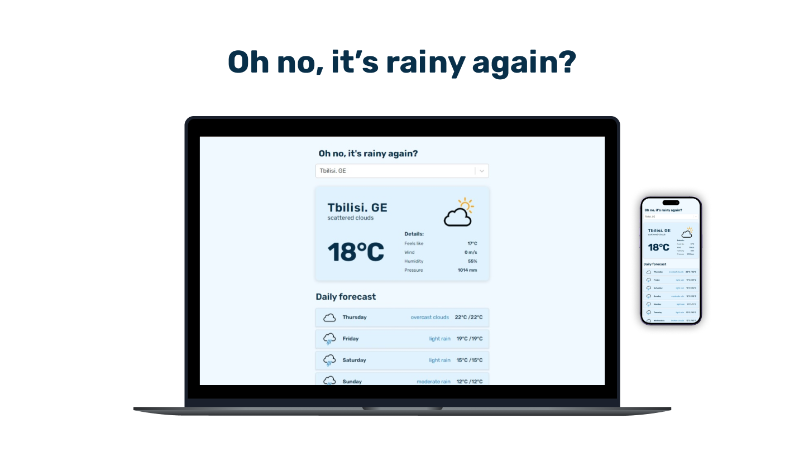

# ohNoItsRainyAgain. Small app to check weather.
[Link to project](ohnoitsrainyagain.netlify.app)

## Used stack: 

- [ReactJS](https://react.dev/)
- [TypeScript](https://www.typescriptlang.org/)
- HTML/CSS
- [Framer Motion](https://www.npmjs.com/package/framer-motion/)
- [react-select](https://react-select.com/home)
- [react-accessible-accordion](https://www.npmjs.com/package/react-accessible-accordion)

